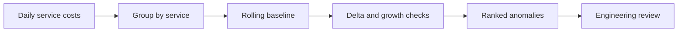

# Cloud Cost Anomaly Detector

[](https://github.com/SriGantikotaKal/cloud-cost-anomaly-detector/actions/workflows/python-tests.yml)

A rolling-baseline anomaly detector for cloud spend. It flags service-level cost spikes using absolute delta and percentage growth thresholds, then ranks anomalies for engineering review.

## Why recruiters should care

This fits cloud platform, infrastructure, reliability, and FinOps teams at companies running high-scale services where cost, performance, and reliability have to be managed together.

## Architecture



## Run tests

```powershell
python -m unittest discover -s tests
```

## Run the demo

```powershell
python -m src.cli samples/sample.json
```

## Design decisions

- Combines absolute and relative thresholds to reduce noisy alerts.
- Ranks by dollar impact so engineers can triage high-value issues first.
- Uses simple rolling averages for transparent investigation handoffs.

## Roadmap

- Add service-owner routing.
- Add weekday/weekend baseline separation.
- Export anomaly summaries to CSV or dashboard-ready JSON.
